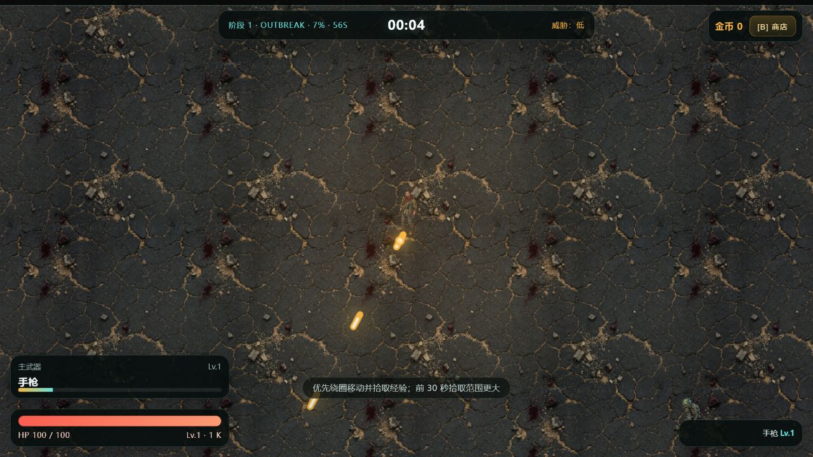

# 🧟 Zombie Survivor · 末日清道夫

A fast, browser-based top-down zombie survivor. Outrun the horde, auto-fire into the swarm, and build a run that can survive long enough to take down the Hive Tyrant. Runs entirely in the browser — no install, no account, just click and play.

[](LICENSE)
[](https://www.typescriptlang.org/)
[](https://vitejs.dev/)

### ▶ [Play Now](https://zombie-survivor.huz43462.workers.dev/)

[English](README.md) · [简体中文](README.zh-CN.md)



---

## What it is

You're dropped into an open arena with a pistol and a rising tide of the dead. Your gun fires on its own toward the cursor, so the whole game lives in your feet: kite the swarm, carve openings, scoop up the gold and XP your kills drop. Every few levels you pick one of three upgrades, and the build you stitch together is what decides whether you make it to the boss.

It starts as a cleanup job. It ends with hundreds of zombies on screen and a boss that summons its own.

## Why it's fun

- **Auto-fire, all movement.** No reloading, no aiming clicks — your attention goes entirely into positioning and crowd control. Easy to start, hard to master.
- **A tactical HUD that reads at a glance.** Stage, timer, threat, gold, HP, primary weapon and inventory slots now sit in clear combat-priority zones instead of competing for attention.
- **A kinder opening minute.** Early spawn pressure ramps up gradually, pickup range is boosted during onboarding, and later stage transitions grant readable gold/health rewards.
- **Real equipment art.** Shop consumables and buffs now use a unified set of 96x96 transparent tactical item icons instead of emoji placeholders.
- **Stronger depth and motion.** Actors sort by their feet, each firearm is composited into a complete two-handed character stance, and feet-anchored recoil, muzzle light, pickup streaks, and atmosphere grading make combat feel more physical.
- **Five escalating stages.** The run ramps in visible steps, from a handful of walkers to wall-to-wall hordes. You can *feel* each stage tighten.
- **A boss with a kit.** The Hive Tyrant telegraphs its entrance, sprays radial bullet volleys, slams the ground for a shockwave, and calls in reinforcements. It's a fight, not a damage sponge.
- **Build variety.** Six weapons (each with a Lv.6 evolution), a deck of stat passives, shop consumables, and run-only active skills — every run reaches for a different combo.
- **Active skills you actually pilot.** Dash through a pack, burst the room, pop a barrier, or slow time. Bought from the shop mid-run, mapped to `Z` `X` `C` `V` with live cooldown slots.
- **It feels good to play.** Screen shake, hit flashes, muzzle sparks, shockwaves, a procedural run cycle, lingering corpses and blood decals — all on plain Canvas 2D, all running smooth with a crowded screen.

## Enemies

| | |
|---|---|
| **Walker** | The baseline shambler. Slow, relentless, always more. |
| **Runner** | Closes distance fast — punishes lazy spacing. |
| **Spitter** | Ranged acid; forces you to keep moving. |
| **Exploder** | Rushes in and detonates. Pop it early or pay for it. |
| **Brute** | A wall of HP that shrugs off knockback. |
| **Hive Tyrant** | The boss. Volleys, slams, and summons — survive it to win. |

## Controls

| Action | Input |
|---|---|
| Move | `W` `A` `S` `D` / Arrow keys |
| Aim | Mouse (fires automatically) |
| Use item slots | `Q` `E` `R` |
| Active skills | `Z` Dash · `X` Burst · `C` Barrier · `V` Time Slow |
| Open shop | `B` |
| Pick a level-up | `1` / `2` / `3` |
| Start / restart | `Space` |

## The shop

Kills drop gold. Press `B` any time to spend it. Early on the shop stocks consumables — grenades, healing, shields, timed buffs. From Stage 3 the active-skill cards unlock; buy one and it's yours for the rest of the run, with its cooldown shown on the HUD.

## Run it locally

```bash
npm install
npm run dev
```

Open the local URL Vite prints (defaults to `http://localhost:5173`).

| Command | What it does |
|---|---|
| `npm run dev` | Dev server with hot reload. |
| `npm run build` | Type-check, then build to `dist/`. |
| `npm run preview` | Serve the production build locally. |
| `npm test` | Run the test suite (unit + a headless game simulation). |

## Built with

TypeScript and Vite, rendered on Canvas 2D, with a small custom ECS at its core. The simulation is deterministic — a seeded RNG plus entity/component storage — which lets a headless harness replay full runs in tests without a browser. Game data (enemies, weapons, skills) is validated with Zod schemas at load time.

```
src/
├── ecs/        entity/component storage + seeded deterministic RNG
├── systems/    movement, spawning, combat, weapons, pickups, equipment, skills
├── render/     Canvas renderer, asset loading, sprite sizing
├── data/       balance, enemies, weapons, passives, equipment, skills
├── fx/         particles, corpses, blood decals
├── sim/        headless simulation (shares the live systems)
├── ui/         DOM overlay (title, HUD, level-up, shop, results)
└── game.ts     state machine, system pipeline, world rendering
```

## License

[MIT](LICENSE). Art and audio under `public/assets/` follow the notes in [`public/assets/ASSETS.md`](public/assets/ASSETS.md).
