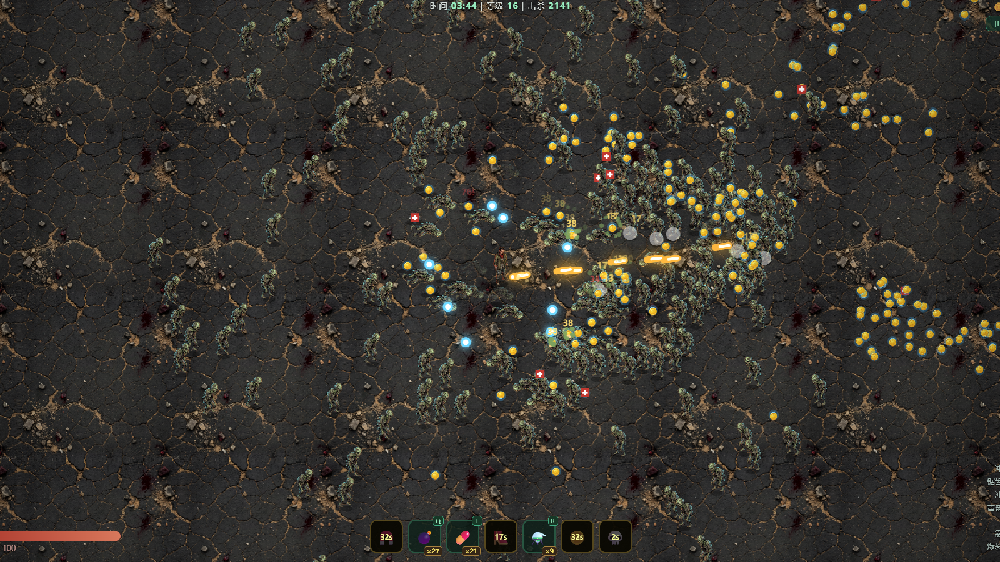

<div align="center">

# Zombie Survivor

**English** | [简体中文](#简体中文)

2D top-down zombie survivor roguelite built with TypeScript, Vite, Canvas 2D, and a small custom ECS.




</div>

## English

Zombie Survivor is a browser-based survival action game about holding the line against a growing horde. Move, aim, collect XP, build a loadout, buy tactical items, and survive long enough to bring down the boss.

### Features

- Fast top-down combat with automatic weapon fire.
- Deterministic custom ECS simulation with a headless test harness.
- Weapons, passives, evolutions, shop items, shields, buffs, XP, coins, and pickups.
- Canvas 2D renderer with sprite assets, screen shake, hit flashes, particles, tracers, corpses, and blood decals.
- One consistent player character sprite; weapon identity is expressed through projectiles, effects, upgrades, and UI.

### Controls

| Action | Input |
|---|---|
| Move | `WASD` / Arrow keys |
| Aim | Mouse |
| Open shop | `B` |
| Pick level-up choice | `1` / `2` / `3` |
| Use items | Item hotkeys shown in the HUD |

### Quick Start

```bash
npm install
npm run dev
```

Open the local Vite URL printed in the terminal.

### Scripts

```bash
npm test
npm run typecheck
npm run build
npm run preview
```

### Project Layout

- `src/ecs/`: entity-component storage and deterministic RNG.
- `src/systems/`: gameplay systems for movement, spawning, combat, weapons, pickups, and equipment.
- `src/render/`: Canvas renderer, asset loading, sprite sizing, and player sprite selection.
- `src/data/`: balance, enemies, weapons, passives, and equipment definitions.
- `public/assets/`: runtime sprites and audio.
- `tests/`: Vitest coverage for core systems and headless simulation.
- `docs/`: development notes and screenshots.

### Roadmap

- Optional GitHub Pages deployment.
- Better balancing for late-game item economy.
- More unified 2D character animation if new character art is produced.
- Real held-weapon interaction via layered sprites and hand anchors, not unrelated character swaps.

### License

MIT License. See [LICENSE](LICENSE).

---

## 简体中文

Zombie Survivor 是一个浏览器 2D 俯视角丧尸生存 roguelite。你需要移动、瞄准、收集经验、升级武器、购买道具，并在尸潮中坚持到 Boss 战。

### 特色

- 快节奏俯视角战斗，武器自动朝鼠标方向开火。
- 自研 ECS 与确定性模拟，支持 headless 测试。
- 包含武器、被动、进化、商店道具、护盾、增益、经验、金币和拾取物。
- Canvas 2D 渲染，包含精灵图、屏幕震动、受击闪烁、粒子、弹道、尸体和血迹效果。
- 当前版本只保留一个统一主角形象；武器差异通过弹道、特效、升级和 UI 表达，避免人物风格混乱。

### 操作

| 行为 | 输入 |
|---|---|
| 移动 | `WASD` / 方向键 |
| 瞄准 | 鼠标 |
| 打开商店 | `B` |
| 选择升级 | `1` / `2` / `3` |
| 使用道具 | HUD 中显示的道具快捷键 |

### 快速开始

```bash
npm install
npm run dev
```

然后打开终端中 Vite 输出的本地地址。

### 常用命令

```bash
npm test
npm run typecheck
npm run build
npm run preview
```

### 项目结构

- `src/ecs/`：实体组件存储和确定性随机数。
- `src/systems/`：移动、生成、战斗、武器、拾取、装备等玩法系统。
- `src/render/`：Canvas 渲染、资源加载、精灵尺寸和玩家精灵选择。
- `src/data/`：数值、敌人、武器、被动和装备定义。
- `public/assets/`：浏览器运行时加载的图片和音频资源。
- `tests/`：核心系统和无头模拟测试。
- `docs/`：开发说明和截图。

### 后续方向

- 可选配置 GitHub Pages 在线试玩。
- 调整后期金币和道具经济。
- 如果有统一美术资源，再补主角动画。
- 若要做真实持枪互动，建议使用 2D 分层角色和手部锚点，不要混用不同人物图。

### 开源协议

MIT License，见 [LICENSE](LICENSE)。
