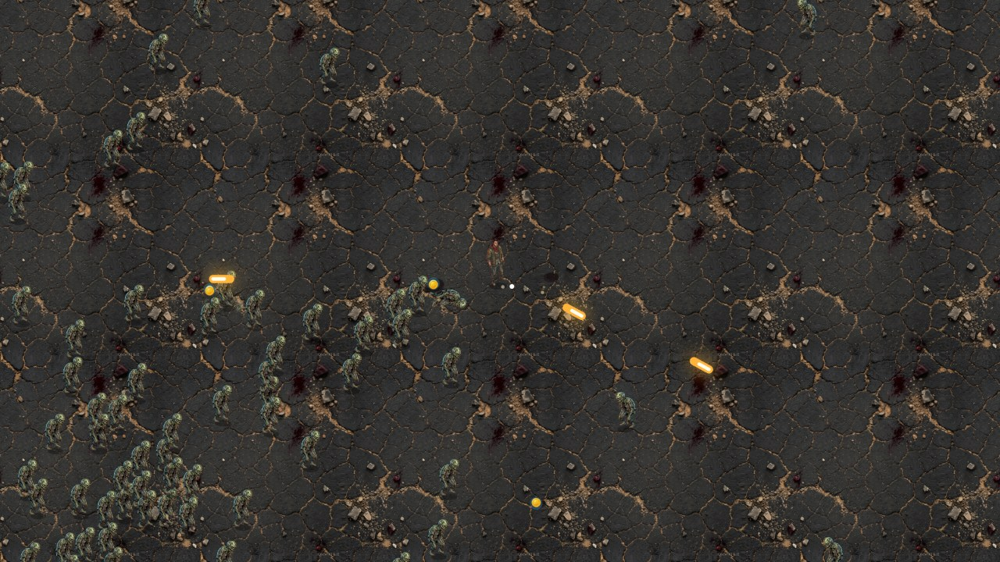

<div align="center">

# 🧟 末日清道夫 · Zombie Survivor

**一款快节奏、纯浏览器运行的俯视角丧尸生存 roguelite —— 基于 TypeScript、Vite、Canvas 2D 和一个轻量确定性 ECS 从零构建。**

[](LICENSE)
[](https://www.typescriptlang.org/)
[](https://vitejs.dev/)
[](https://vitest.dev/)

### [▶ 立即试玩](https://zombie-survivor.huz43462.workers.dev/)

[English](README.md) · **简体中文**



</div>

---

## 简介

在 5 个逐步升级的阶段中坚守阵地。每个阶段都会提高尸潮上限和生成压力，最终 **母巢暴君** 会带着入场预警、环形弹幕、召唤尸潮和震地冲击波登场。

整个模拟跑在一个自研的轻量 ECS 上，完全确定性 —— 同一套系统既驱动实机游戏，也驱动无头测试，因此数值平衡可以在 CI 里验证，无需浏览器。

## ✨ 特色

- ⚡ **快节奏俯视角战斗** —— 武器自动朝鼠标开火，你只需专注走位和拉扯。
- 🧭 **阶段型尸潮压力** —— 5 个可见阶段会逐步提高敌人上限和生成密度。
- 🧬 **确定性 ECS** —— 实体/组件存储 + 带种子的随机数，由无头模拟测试覆盖。
- 🔫 **Boss 战有技能** —— 母巢暴君会提前预警、发射环形弹幕、召唤援军并震击战场。
- 🛒 **消耗品经济** —— 金币是可持续消耗的资源：购买充能、限时药剂和可叠加护盾。
- 🎨 **多汁的 Canvas 2D 渲染** —— 精灵图、程序化跑步动作、屏幕震动、受击闪烁、冲击波、粒子、弹道、尸体与血迹。
- 🧟 **六种敌人原型** —— 行尸、疾跑者、喷吐者、自爆体、壮汉，以及母巢暴君 Boss。

## 🎮 操作

| 行为 | 输入 |
|---|---|
| 移动 | `W` `A` `S` `D` / 方向键 |
| 瞄准 | 鼠标（自动开火） |
| 使用道具槽 | `Q` `E` `R` |
| 打开商店 | `B` |
| 升级三选一 | `1` / `2` / `3` |
| 开始 / 重开 | `Space` |

## 🚀 快速开始

```bash
npm install
npm run dev
```

然后打开终端中 Vite 输出的本地地址（默认 `http://localhost:5173`）。

## 🛠️ 常用命令

| 命令 | 作用 |
|---|---|
| `npm run dev` | 启动带热更新的 Vite 开发服务器。 |
| `npm run build` | 先类型检查，再构建生产包到 `dist/`。 |
| `npm run preview` | 本地预览生产构建。 |
| `npm run typecheck` | 运行 `tsc --noEmit`。 |
| `npm test` | 运行 Vitest 测试（单元 + 无头模拟）。 |

## 📦 技术栈与目录

使用 **TypeScript**、**Vite 6**、**Canvas 2D**、**Vitest** 和 **Zod**（schema 校验）构建 —— 没有游戏引擎，也没有运行时 UI 框架。

```
src/
├─ ecs/        实体/组件存储 + 带种子的确定性随机数
├─ systems/    移动、生成、战斗、武器、拾取、装备等系统
├─ render/     Canvas 渲染、资源加载、精灵尺寸
├─ data/       数值、敌人、武器、被动、装备定义
├─ fx/         粒子、尸体、血迹
├─ sim/        无头模拟（复用实机系统）
├─ ui/         DOM 覆盖层（标题、HUD、升级、商店、结算）
└─ game.ts     状态机、系统流水线、世界渲染
public/assets/ 运行时加载的精灵图与音频
tests/         核心系统 + 无头模拟的 Vitest 覆盖
```

## 🗺️ 后续方向

- [ ] 可选的 GitHub Pages 部署，点开即玩。
- [ ] 后期道具经济的数值微调。
- [ ] 若有新美术，做更丰富的逐敌人动画。
- [ ] 带手部锚点的分层持枪精灵。

## 📄 开源协议

[MIT](LICENSE) © 贡献者。`public/assets/` 下的美术与音频资源遵循 [`public/assets/ASSETS.md`](public/assets/ASSETS.md) 中的说明。
