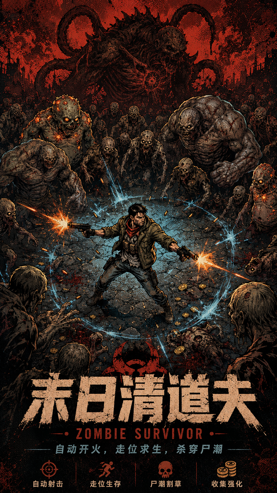

# 🧟 末日清道夫 · Zombie Survivor

一款快节奏的浏览器俯视角丧尸生存游戏。甩开尸潮、自动开火、在不断收割的过程中拼出一套能撑到母巢暴君面前的 Build。纯网页运行——不用安装、不用注册，点开就能玩。

[](LICENSE)
[](https://www.typescriptlang.org/)
[](https://vitejs.dev/)

<p align="center">
  
</p>

### ▶ [立即游玩](https://zombie-survivor.pages.dev/)

[English](README.md) · 简体中文

---

## 这是什么

选一名干员，被丢进一片开阔的战场，手里只有一把起手枪械，面前是越涌越多的丧尸。枪会自动朝鼠标方向开火，所以整局游戏都靠你的走位：拉扯尸群、撕开缺口、维持连杀链、抢空投、追黄金逃亡者。每升几级就三选一拿一个强化，而你一路拼出来的 Build，决定了你能不能活到 Boss 面前——以及之后的无尽尸潮里能走多远。

开局像在打扫战场，到后面会变成满屏几百只丧尸、还有一个会召唤援军的 Boss。

## 为什么好玩

- **三名可选干员，越打越强。** 游侠（攻速）、重装（血量换移速）、猎手（暴击玻璃炮）——不同起手武器和属性，开局思路完全不同。每局结算干员经验：击杀、生存、精英、胜利都算数，升级永久强化各自的招牌属性（最高 Lv.10），标题卡实时显示等级与经验条。
- **救援幸存者，组建小队。** 战场上会定期出现被困的幸存者——赶在他们放弃之前抵达即可入队（上限 2 人）：机枪手远程速射、火焰兵近距洗地、军医定期为你回血。僚机会跟随走位、承受尸潮撕咬，也会永远倒下——然后新的幸存者会再次出现。
- **连杀即倍率。** 击杀在 4 秒窗口内连成链：连击 → 杀戮 → 狂热 → 灭世，经验和金币随档位放大，掉一滴血立刻断链。走位越极限，滚雪球越快。
- **精英变异体。** 迅捷 / 巨力 / 剧毒词缀精英随时间上场，带光环、名牌与数倍奖励；剧毒死后还会炸出一圈酸液。见到光环，先想清楚再上。
- **空投与血月改变战局。** 每 42 秒一箱空投伞降（金币 / 全场磁吸 / 武器升级 / 护盾……六种奖励开箱揭晓）；血月定时降临——刷怪 ×2.3、移速 +12%、金币 +60%，屏幕染红的十几秒是风险也是暴富窗口。
- **黄金逃亡者。** 一只全速逃跑的金色目标，追上就是一地金币，追不上它就溜了——每分钟一次的追逐战。
- **血怨祭坛，自选难度。** 阶段 2 起每阶段升起一座祭坛：踏入即立约——刷怪与精英更多，换经验金币更肥。敢贪就有得赚。
- **20 项成就，输赢都有进度。** 单局连击 / 精英击破 / 零接触开局 / 累计击杀……局内实时弹出解锁，标题页成就墙与结算页进度永久保存。
- **濒死翻盘。** 血量首次跌破 20% 触发一次肾上腺素爆发：回血、无敌、震开身边尸群——把"快死了"变成高光时刻。
- **八把武器 + 各自进化。** 手枪、霰弹、冲锋枪、马格南、冲击波、环刃，再加火焰喷射器（近距火舌洗地）与火箭筒（爆炸溅射）——满级进化为终极形态。
- **自动开火，全靠走位。** 不用换弹、不用点射，注意力全花在站位和拉扯上。上手简单，玩好很难。
- **有完整技能组的 Boss，赢了还没完。** 母巢暴君弹幕、震地、召唤俱全；击败后可进入**无尽尸潮**——暴君每 110 秒回归且一次比一次强，血月循环降临，看你能走多远。
- **真正由你操控的主动技能。** 疾冲穿过尸群、爆破清场、开屏障扛伤、放迟滞拖慢时间。中途在商店购买，绑定 `Z` `X` `C` `V`，HUD 上实时显示冷却。
- **打起来很爽。** 分级伤害数字、连击计数器与狂热屏幕光效、空投伞降与开箱播报、血月红幕、屏幕震动、命中闪光、尸体与血迹——全部跑在朴素的 Canvas 2D 上，满屏怪也依然流畅。

## 敌人

| | |
|---|---|
| **行尸** | 最基础的步行者。慢，但不停，而且永远有更多。 |
| **疾跑者** | 拉近距离极快，专治不好好留距离的玩家。 |
| **喷吐者** | 远程酸液，逼着你一直动。 |
| **自爆体** | 冲过来就引爆，得趁早打掉，否则吃亏。 |
| **壮汉** | 一堵血墙，几乎不吃击退。 |
| **精英变异体** | 迅捷 / 巨力 / 剧毒词缀随机上身，光环名牌标记，奖励数倍——剧毒死后会炸酸液圈。 |
| **黄金逃亡者** | 不攻击、只逃命。限时击杀，掉一喷泉金币。 |
| **母巢暴君** | Boss。弹幕、震地、召唤——撑过它就赢了。赢了还能挑战无尽尸潮。 |

## 操作

| 行为 | 输入 |
|---|---|
| 移动 | `W` `A` `S` `D` / 方向键 |
| 瞄准 | 鼠标（自动开火） |
| 使用道具栏 | `Q` `E` `R` |
| 主动技能 | `Z` 疾冲 · `X` 冲击爆破 · `C` 能量屏障 · `V` 时间迟滞 |
| 打开商店 | `B` |
| 选择升级 | `1` / `2` / `3` |
| 选择干员 / 开始 / 重开 | 鼠标点选 + `Space` |
| 暂停 / 继续 | `Esc` / `P` |
| 胜利后进入无尽尸潮 | `E` 或点击按钮 |

## 商店

击杀掉落金币，随时按 `B` 花掉。前期商店卖消耗品——手雷、治疗、护盾、临时增益。从第 3 阶段起解锁主动技能卡：买下后本局永久持有，冷却会显示在 HUD 上。

## 本地运行

```bash
npm install
npm run dev
```

打开 Vite 输出的本地地址（默认 `http://localhost:5173`）。

| 命令 | 作用 |
|---|---|
| `npm run dev` | 启动带热更新的开发服务器。 |
| `npm run build` | 先类型检查，再构建到 `dist/`。 |
| `npm run preview` | 本地预览生产构建。 |
| `npm test` | 运行测试（单元测试 + 无头游戏模拟）。 |

## 技术栈

使用 TypeScript + Vite，渲染基于 Canvas 2D，核心是一套自研的轻量 ECS。整套模拟是确定性的——种子随机数加上实体/组件存储——因此无头测试可以脱离浏览器完整复现一整局。游戏数据（敌人、武器、技能）在加载时用 Zod schema 校验。

```
src/
├── ecs/        实体/组件存储 + 种子确定性随机数
├── systems/    移动、生成、战斗、武器、拾取、装备、技能、连击、空投
├── render/     Canvas 渲染、资源加载、精灵尺寸
├── data/       数值、敌人、武器、被动、装备、技能、精英、干员
├── fx/         粒子、尸体、血迹
├── sim/        无头模拟器（复用真实系统）
├── ui/         DOM 覆盖层（标题、HUD、升级、商店、结算）
└── game.ts     状态机、系统流水线、世界渲染
```

## 许可

[MIT](LICENSE)。`public/assets/` 下的美术与音频资源请遵循 [`public/assets/ASSETS.md`](public/assets/ASSETS.md) 中的说明。
