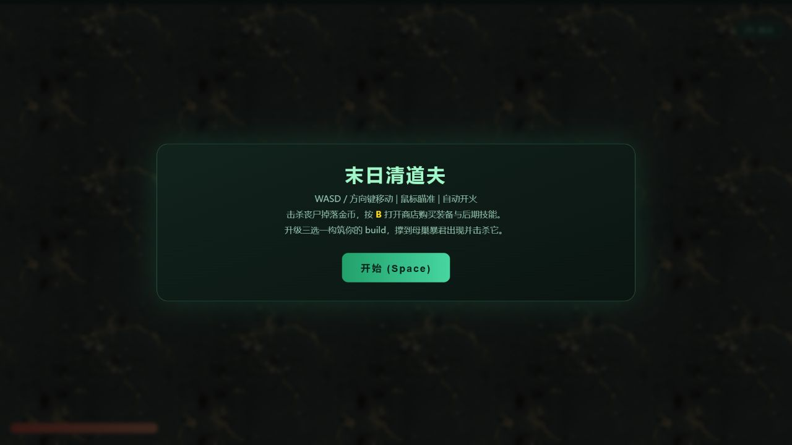
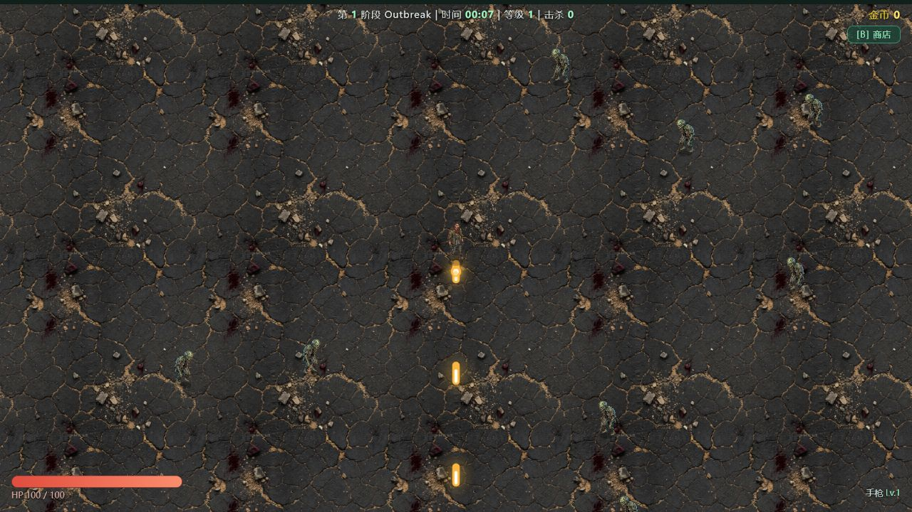
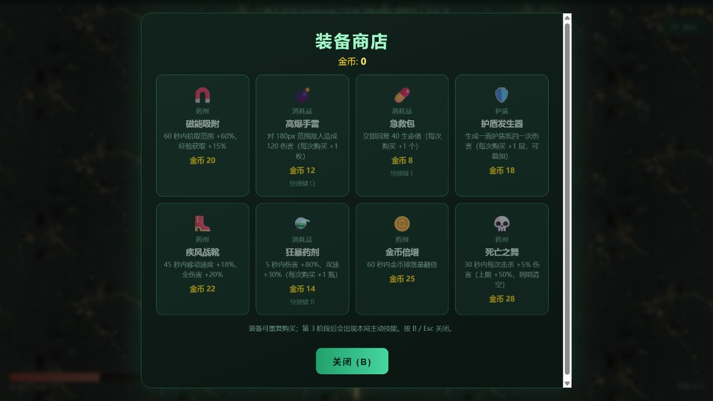
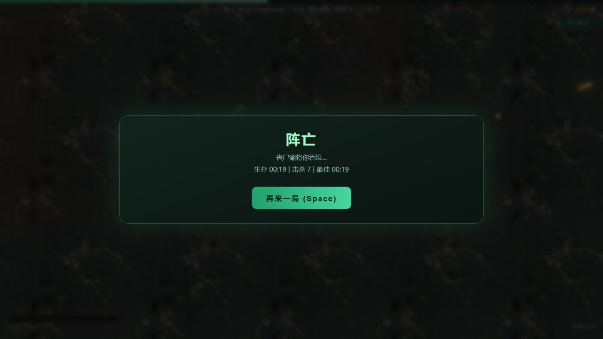

# Zombie Survivor 产品审查与竞品调研

调研日期：2026-06-30  
审查画布：[Zombie Survivor · UX Audit & Redesign](https://www.figma.com/design/ANHbIKcprJWFKTYNrINbtR)

## 调研范围

- 产品：浏览器端俯视角丧尸生存 Roguelite。
- 目标玩家：希望快速开局、在 10–30 分钟内完成一局、通过 Build 获得滚雪球爽感的轻中度动作玩家。
- 审查路径：开始界面 → 实战 HUD → 商店 → 阵亡结算。
- 竞品范围：Brotato、20 Minutes Till Dawn、Halls of Torment。
- 重点：UI 识读、战斗反馈、玩法节奏、图片风格、人物动作、伪 3D 深度与长期目标。

## Executive read

当前版本已经具备可玩的生存 Roguelite 主循环：自动射击、阶段式刷怪、三选一成长、商店、主动技能和 Boss 战均已存在。主要短板不是“内容太少”，而是关键内容没有被清楚地呈现：角色和敌人尺寸偏小，HUD 信息层级弱，商店需要同时阅读八张等权重卡片，阵亡后也没有复盘或下一目标。首次审查中，角色在 19 秒左右阵亡，说明新玩家在理解移动、瞄准、拾取和受击节奏前就可能失败。现有代码已有弹道、命中闪光、震屏、残影、尸体、血迹和程序化跑动，但低尺度与同色调使这些反馈没有形成足够强的“击中—击杀—成长”节奏。最合适的方向不是改成真正 3D，而是在保留 Canvas 2D 和现有素材的前提下，采用“战术末日 × 预渲染伪 3D”：放大角色、强化脚底投影与高度关系、增加分层光效和更明确的动作姿态。第一阶段应先解决识读与新手节奏，再做视觉升级和玩法扩展，否则更丰富的特效只会进一步增加画面噪声。

## 当前流程审查

### Step 1 · 开始界面

- 健康度：可用，但缺少角色与目标预览。
- 优点：主操作只有一个，键盘提示明确。
- UX 风险：未展示本局时长、成长目标和最基本的生存技巧。
- 可访问性风险：浅绿色小字叠在动态暗背景上，字号与对比度偏弱。
- 建议：加入角色主视觉、三个核心玩法标签和首次游玩引导。

### Step 2 · 实战 HUD

- 健康度：核心循环成立，但战斗识读弱。
- 优点：场地无遮挡，生命、阶段、等级和金币持续可见。
- UX 风险：角色和敌人尺度偏小；阶段、时间、等级挤在顶部；当前目标与升级进度不突出。
- 可访问性风险：关键数字过小；生命与经验过度依赖颜色区分。
- 建议：放大玩家 30–40%，重组 HUD，并强化受击、拾取、击杀和即将升级的反馈。

### Step 3 · 商店

- 健康度：内容完整，但选择成本高。
- 优点：价格、类型和快捷键均有展示。
- UX 风险：八张卡片同时出现且视觉权重相同；描述密集；金币不足时仍需逐卡判断；Emoji 图标与技能图片风格不统一。
- 可访问性风险：灰绿正文对比不足，滚动条抢视觉，键盘焦点不明显。
- 建议：按生存、输出、技能分组；统一真实图标；增加推荐标签、购买差额和持有状态。

### Step 4 · 阵亡结算

- 健康度：可重开，但缺少复盘与长期目标。
- 优点：成绩简短，重新开始入口明确。
- UX 风险：没有死因、Build 总结、奖励或下一目标。
- 可访问性风险：动态战场仍在背景播放，可能干扰阅读。
- 建议：展示死因、最佳武器、获得资源、解锁进度和一键重开。

### 证据边界

- 本轮有效截图覆盖入口、实战 HUD、商店和阵亡结算。
- 升级三选一因审查控制无法持续移动，角色在触发升级前阵亡而未捕获；该流程仅从源码确认存在，不作为截图审查证据。
- 截图无法证明完整键盘、读屏或 WCAG 合规，仍需后续浏览器专项验证。

## 竞品模式

| 竞品 | 可借鉴模式 | 对本项目的启发 |
| --- | --- | --- |
| Brotato | 20–90 秒短波次、波间商店、自动射击、可调敌人生命/伤害/速度 | 将商店从随时暂停改成阶段节点，减少战斗中断；为新手提供可理解的难度缓冲 |
| 20 Minutes Till Dawn | 10–20 分钟短局、50+ 升级、角色与武器解锁、跨局 Rune 成长、Boss Tome | 让阵亡也产生长期进度；升级卡要表达路线与协同，而不只显示数值 |
| Halls of Torment | 预渲染复古伪 3D、任务式元进度、多角色、多环境、独特 Boss 机制 | 用预渲染人物、阴影和地面层次建立深度；通过任务与环境变化提供长期目标 |

来源：

- [Brotato 官方 Steam 页面](https://store.steampowered.com/app/1942280/Brotato/?l=english)
- [20 Minutes Till Dawn 官方 Steam 页面](https://store.steampowered.com/app/1966900/20_Minutes_Till_Dawn/?l=english)
- [Halls of Torment 官方 Steam 页面](https://store.steampowered.com/app/2218750/Halls_of_Torment/?l=english)

## 排名后的问题与机会

### 1. 首局反馈闭环太晚

- 严重度：高；信心：高。
- 证据：审查角色在约 19 秒阵亡，尚未进入升级三选一。
- 机会：前 30 秒降低密度并加入“移动—击杀—拾取—升级”的轻量引导；首个升级提前到 10–15 秒可见。

### 2. 战斗识读不足，已有特效没有形成层级

- 严重度：高；信心：高。
- 证据：角色、敌人和掉落物在 1280×720 画面中占比很低；HUD 与战场使用接近的灰绿亮度。
- 机会：放大主要单位、增加敌人接触圈/危险色、让子弹、命中、击杀、拾取分别使用稳定的颜色与音效语言。

### 3. Build 决策缺少路线感

- 严重度：中高；信心：中高。
- 证据：当前升级多为单项数值提升，商店八张卡片同权重展示。
- 机会：为武器建立 2–3 条可读路线；升级卡显示“当前 → 变化”和协同标签；商店按玩家当前 Build 推荐。

### 4. 阶段和结算缺少目标牵引

- 严重度：中高；信心：高。
- 证据：阶段只在顶部文字中变化，阵亡页只展示时间、击杀和最佳。
- 机会：阶段切换加入大字提示、特殊波次或精英事件；结算页展示挑战进度、资源和下一解锁。

### 5. 视觉素材缺少统一的产品语言

- 严重度：中；信心：高。
- 证据：角色/敌人为预渲染写实图，技能为独立图标，商店装备仍使用 Emoji。
- 机会：统一为“暗色末日、琥珀火力、青色成长、洋红 Boss”的图标和特效体系；装备图标全部替换为真实图片资产。

## 改进优先级

### 本周可做

1. 重组 HUD、放大玩家与关键敌人、强化经验进度和阶段目标。
2. 加入首局 30 秒节奏保护与即时引导。
3. 商店分组、不可购买差额、Build 推荐和统一图标槽位。
4. 结算增加死因、Build 摘要和下一目标。

### 本季度方向

1. 加入精英事件、阶段奖励箱和波次节点商店。
2. 建立任务式跨局进度与角色/武器解锁。
3. 形成完整伪 3D 渲染层：投影、遮挡顺序、地面视差、灯光脉冲、角色跑动/受击/死亡姿态。

### 仍需验证

1. 三种视觉方向的玩家偏好与可实现成本。
2. 首局 30 秒的敌人密度、移动速度和首个升级时间。
3. 满屏 300–400 敌人时的新特效性能预算。

